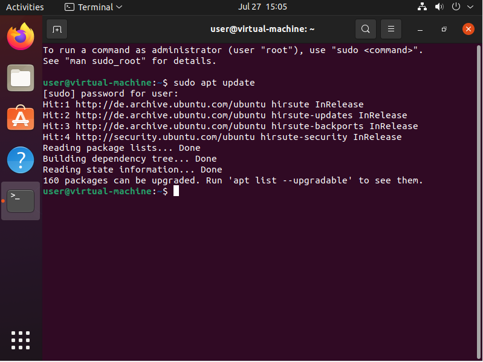
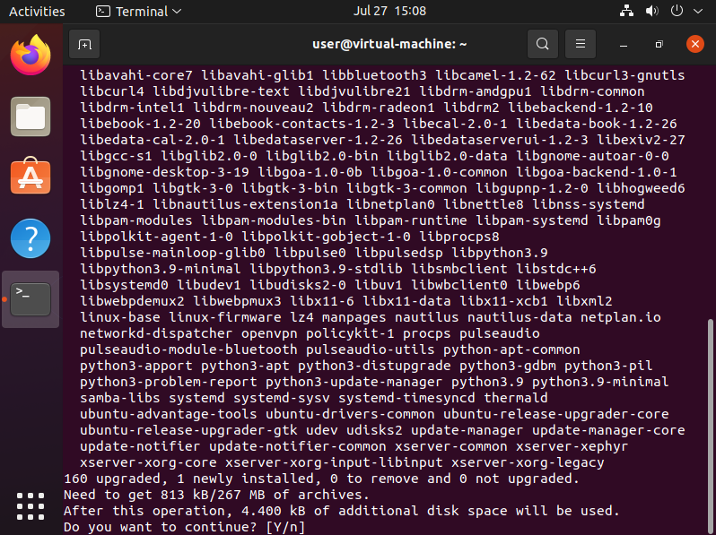
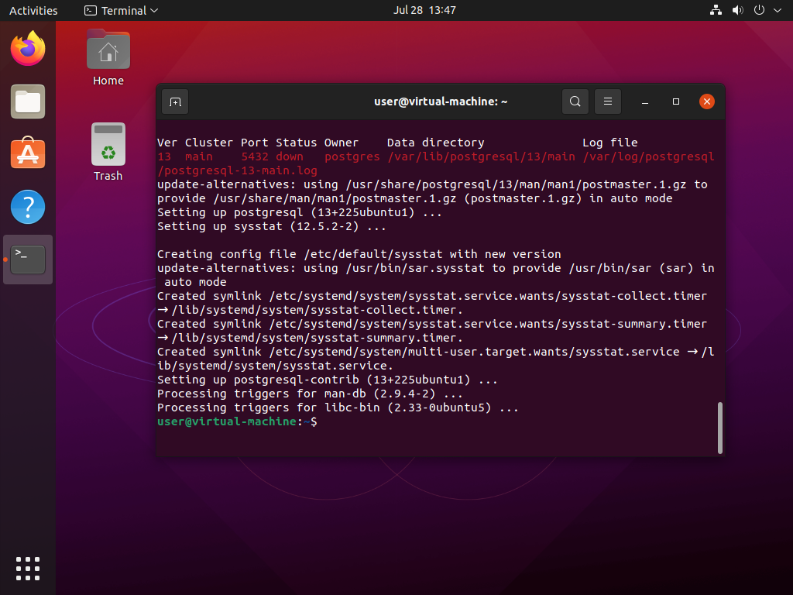

# Installation Tutorial

To follow this course, an installation of **PostgreSQL 13** or higher is expected.

The following is a detailed tutorial as to
    how to install and set up a Postgres server
    on an [Ubuntu Linux](https://ubuntu.com) machine
    that is run **[virtually ](https://en.wikipedia.org/wiki/Virtual_machine)**
    on the student's own laptop or workstation by [VirtualBox](https://www.virtualbox.org/).
VirtualBox is freely available for all major operating systems
    (i.e., MacOS, Linux, and Windows).
It is used in this course as then each student should be able
    to follow the further installation instructions below easily
    and end up having a development environment similar to the instructor's one.
Of course, students may also use any other way of setting up a PostgreSQL server;
    most notably, they may install it on their machine *without* a virtualization.

## Install VirtualBox

Go to [virtualbox.org](https://www.virtualbox.org/),
    download the latest version of VirtualBox for your operating system,
    and install it according to the instructions given there.

## Create a new Virtual Machine

First, go to [ubuntu.com](https://ubuntu.com/download/desktop),
    download the latest version (i.e., 21.04 at the time of this writing)
        of **Ubuntu Desktop** (i.e., *not* server),
    and proceed with the following steps.
Ubuntu is available for free;
    the name of the downloaded file should be something like "*ubuntu-21.04-desktop-amd64.iso*"
    (i.e., one big ISO file).
This file represents the contents of an "Ubuntu Installation DVD".

Next, create a new virtual machine in VirtualBox
    by clicking on the blue "New" button in the toolbar on the top.
Note that the screenshots of VirtualBox's overview window below
    already show an older virtual machine running Windows 10.

A helper widget opens.
Specify the following settings:
1. Name the virtual machine (e.g. "*Ubuntu_21.04*")
   and choose a folder on your personal computer
       where the virtual machine's data are stored
       (e.g. "*/home/webartifex/vboxes*").
   The type and version should already be set automatically.
2. Choose the amount of memory (i.e., RAM)
   that the virtual machine is allowed to use:
   This should be around 33% to 66% of your personal computer's capacity
   (if unsure, take the recommended default).
3. Create a *new* virtual hard disk,
4. keep the hard disk file type as "*VDI*",
5. have the storage on the physical hard disk allocated *dynamically*, and
6. choose a big enough maximum size for the file holding the virtual hard disk
   (10-25 GB is sufficient to follow this course).
   Dynamic disk space allocation means that
       not all of this space is used right away on your personal computer.

After this, the new virtual machine should show up in the overview.

To start the new virtual machine,
    click on the green "Start" arrow in the toolbar
    while the machine is selected on the left.
A second VirtualBox window opens showing the virtual machine's screen.
On the first start-up, a widget should come up automatically
    (see next paragraph if the widget does not appear)
    asking to select a start-up disk (i.e., a CD or DVD)
    from which the empty virtual machine should boot up.
Choose the downloaded ISO file from above
    (if it is not already found automatically)
    and proceed by clicking on "Start".
Continue with the "[Install Ubuntu](#install-ubuntu)" step below.

### Inserting CDs/DVDs

If the "Select start-up disk" widget does *not* show up automatically,
    the virtual machine will *not* boot at all.
After all, its hard drive is empty and no DVD/ISO is "laid in".
So, its screen remains black.
In that case, close the window with the running virtual machine:
    In the prompt, choose the "Power off the machine" option.
Then, in the overview,
    click on the orange "Settings" button in the toolbar
    while the machine is selected on the left.
A "Settings" widget opens: Choose the "Storage" tab on the left.
There, click on the round disk symbol to the right of "Controller: IDE",
    which opens another "Optical Disk Selector" widget.
In that, click on the "Add" button,
    choose the downloaded ISO file from above, and
    click on "Choose" to confirm the selection.
Now, you should see the ISO file's name
    below the "Controller: IDE" option in the middle.
Finally, close the "Settings" menu by clicking "Ok"
    and start the virtual machine again.

## Install Ubuntu

With the Ubuntu Installation DVD/ISO "laid in",
    the virtual machine should now boot up properly
    and stop at a "Welcome" screen.
There, click on the "Install Ubuntu" button.
You may want to choose a language other than "English".

**Note**: Once you click somewhere with your mouse inside a virtual machine,
    the mouse pointer is said to be "captured" by that machine and
    you can *not* leave the virtual machine any more with your mouse.
Then, you must press the so-called **host key** first.
By default, this is the right "*Ctrl*" key on your keyboard.

Sometimes, the boot process "hangs" at a black "boot loader" screen.
If so, simply choose the "Ubuntu" option
    with your keyboard's arrow and "Enter" keys.
That should take you to the above "Welcome" screen.

From the "Welcome" screen, follow the installation guide:
1. Choose a keyboard layout corresponding to your *physical* computer,
2. select "Minimal Installation" including the "other options",
3. erase the virtual hard disk,
4. specify where you are located,
5. create a user account to sign on,
6. wait for the installation to finish, and
7. remove the Installation DVD/ISO
   (by right-clicking on the gray disk symbol below the screen
    and choosing "Remove ...";
    it may be that this happens automatically).

### Configure Ubuntu

After installation, the virtual machine may reboot automatically.
If not, simple start it again.
This takes you to the login screen.
Sign on with the credentials you specified during installation.

If an "Update" widget appears in the next moments,
    simply ignore it by clicking "Remind me later".
You will learn how to update an Ubuntu system from the command line further below.

After the first sign-on, a "First Steps" wizard pops up.
As Ubuntu is only installed on a virtual machine,
    do not connect to any online accounts,
    turn off the background telemetry (e.g., crash reports), and
    disable the location services.

Next, open the application launcher
    by clicking on the dots in the lower left corner,
    seach for the "Terminal" app,
    and open it.

### Update Ubuntu

The first thing you want to always do after a fresh installation
    is to check for available updates.
The command to enter in the terminal is `sudo apt update`.
`sudo` is simply the Linux way of saying
    "the following command needs administrator privileges".
`apt` is Ubuntu's default program to manage the installed [software packages ](https://en.wikipedia.org/wiki/Package_manager).
The sub-command `update` checks if updates are available.
Using `sudo` implies that you have to enter your user's password in the terminal.

As we can tell from the previous screenshot,
    there are packages that can be upgraded.
To start the upgrade process, type `sudo apt upgrade`.
The terminal then asks if it should proceed
    while listing all the packages to be upgraded.
Press the "Enter" key to continue.

Commonly, when individual packages are upgraded,
    they may not need some other package any more to work.
In general, we say that if package *A* needs package *B* to function correctly,
    package *B* is a [dependency ](https://en.wikipedia.org/wiki/Coupling_%28computer_programming%29) of package *A*.
The command `sudo apt autoremove` removes unneeded packages
    from the virtual machine, freeing some of its hard drive's storage.

Finally, after the system upgrade, restart the machine.
You can do that
    by clicking on the tray icons in the upper right corner
    and using the provided graphical options.

Congratulations!
You now have a virtual machine running the latest Ubuntu Linux.

## Install VirtualBox's Guest Additions

In order to make the newly created *virtual* Ubuntu machine,
    which takes the role of the **guest** system,
    interact seamlessly with your *physical* computer,
    which takes the role of the **host** system,
    you can (and should) install VirtualBox's [Guest Additions](https://www.virtualbox.org/manual/ch04.html).
One example for a seamless integration is
    that the guest system's screen resolution auto-adjusts
    whenever you resize the VirtualBox window in that it is running.

To install the Guest Additions,
    first start the virtual machine and sign in.
Then, choose the "Insert Guest Additions CD image ..." in the "Devices" menu
    in the enclosing VirtualBox window.
Just to state the maybe obvious:
    This menu option is *not* available in the Ubuntu system.
Depending on your host system, the menu may look different.
If this option does not exist at all,
    you could also "insert" the Guest Additions CD
    as described in the "[Inserting CDs/DVDs](#inserting-cdsdvds)" section above.
You may be prompted to download the Guest Additions ISO file first.

The Ubuntu guest system should automatically detect
    that the inserted CD has an auto-run option.
Simply, click "Run" and confirm the action with your user's password.

A script is run inside a terminal window.
Wait until this is finished and hit the "Enter" key.

After the installation of the Guest Additions,
    do not forget to eject the CD
    by right-clicking on the disk symbol and selecting "Eject".

### Add a Shared Folder

Another benefit of installing the Guest Additions is
    that you can set up a shared folder
    between your physical host system and the virtual Ubuntu guest system.
You can use that, for example,
    to back up SQL files created inside the virtual machine
    in your common file system.

First, power off the machine
    and open the "Settings" widget with the orange "Settings" button in the toolbar.
There, go to the "Shared Folders" tab on the left.
Then, click on the "Add Folder" symbol on the right,
    and choose a folder on your personal computer's file system
    (e.g., a good choice could be your "Desktop" folder).
Also, check the "Auto-mount" option.

After signing in the next time,
    Ubuntu's file browser should show you the shared folder
    (i.e., "*sf_shared*" in the screenshot below)
    as an external drive (i.e., that's why the "Eject" symbol is next to "*sf_shared*").

## Install PostgreSQL Server

With a ready Ubuntu installation it is now time
    to install and set up a [PostgreSQL](https://www.postgresql.org/) server.

To do so, open a new terminal window in the virtual machine
    and run the `sudo apt install postgresql postgresql-contrib` command.
The `install` sub-command of the `apt` program does what we expect it to.
While the `postgresql` package contains all the basic features,
    the `postgresql-contrib` package offers some common [additional modules](https://www.postgresql.org/docs/10/contrib.html).

With the command `sudo service postgresql status` one can check
    if Postgres is running as a service on the virtual machine.
To exit the status view, press the "q" key.

## Install Git

To clone the [GitHub repository ](https://github.com/webartifex/intro-to-sql)
        with the materials for this course,
    you must first install the [git](https://git-scm.com/) utility.
`git` is a so-called **[version control ](https://en.wikipedia.org/wiki/Version_control)** software.

To do so, run the command `sudo apt install git` in a terminal.

To check if `git` works,
    you could run a command like `git --version`
    that simply shows the installed version of `git`.

`git` is a tool worth learning about in detail.
As a reading recommendation,
    the best source for an introduction to `git`
    is probably the official [online book](https://git-scm.com/book/en/v2/).

### Configure Git

To get `git` to work in our virtual machine,
    we must at least go through the [First-time Git Setup](https://git-scm.com/book/en/v2/Getting-Started-First-Time-Git-Setup) chapter
    in the official book.
In summary,
    you simply have to specify your name and email (or anonymous substitutes)
    in a terminal with the following commands:
- `git config --global user.name "<your name>"` and
- `git config --global user.email "<your email>"`.

To check if the configuration is stored, run `git config --list`.

### Download the Course Materials

To obtain your own copy of the course materials,
    you must "[clone](https://git-scm.com/book/en/v2/Git-Basics-Getting-a-Git-Repository)"
    the [GitHub repository ](https://github.com/webartifex/intro-to-sql)
        with the materials.
That is done with the command `git clone https://github.com/webartifex/intro-to-sql.git`.
In the screenshot,
    you see this done
    after going into the virtual machine's "Desktop" folder with `cd Desktop/`.
Alternatively, you could clone the repository into your user's home folder
    (i.e., what the `~` means).

## Verify Python works

As this course also shows
    how to embed a database like Postgres
    in a typical backend application,
    written, for example, in [Python ](https://www.python.org/),
    we need to ensure that we can start a Python process.

By default, recent Ubuntu versions
    come with [Python 3 ](https://docs.python.org/3/) pre-installed.
The command `sudo apt install python3` confirms that:
    The `python3` package is already there.

We could just as well start an interactive Python shell
    with the simple `python3` command.

Typing `python` for short instead fails.
This command used to point to the Python 2 installation, which has been discontinued.

For convenience, install the `python-is-python3` package.
Then, you may use the `python` and `python3` commands interchangeably.

Congratulations!
You are now all set to follow this course and learn about SQL.

